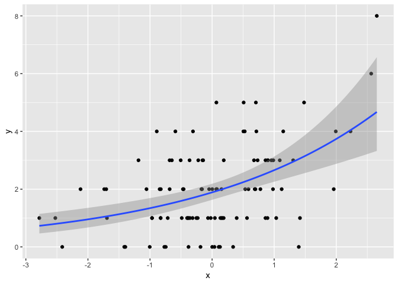

R club - confidence intervals
================
Gesa
14 January 2019

### Simulate Poisson-distributed data

``` r
# generate poisson-distributed data
x <- rnorm(100)
y <- rpois(100, exp(0.6 + 0.4 * x))
dat <- data.frame(x, y)
```

``` r
library(ggplot2)

ggplot(dat, aes(x, y)) +
  geom_point() 
```


### Plot regression line and confidence intervals

``` r
ggplot(dat, aes(x, y)) +
  geom_point() +
  geom_smooth(method = "glm", method.args = list(family = "poisson"), se = T)
```



``` r
ggplot(dat, aes(x, y)) +
  geom_point() +
  geom_smooth(method = "glm", method.args = list(family = "poisson")) +
  # scale_y_log10() + # doesn't work
  coord_trans(y = "log10", limy = c(0.1, 15)) # one option
```

    ## Warning: Transformation introduced infinite values in y-axis


### Plot binomial confidence intervals with ggplot

``` r
x <- rnorm(100)
y <- rbinom(100, 0:1, 0.5)
dat <- data.frame(x, y)
```

``` r
binomial_smooth <- function(...) {
  geom_smooth(method = "glm", method.args = list(family = "binomial"), ...)
}

ggplot(dat, aes(x, y)) +
  geom_point() +
  #geom_smooth(method = "glm", method.args = list(family = "binomial"), se = T) +
  binomial_smooth()
```


### Plot confidence intervals the old-school way

-   calculate values for the regression line
-   calculate upper and lower se values
-   for non-Gaussian, should calculate on transformed scale, then backtransform

``` r
mod <- glm(y ~ x, data = dat, family = "binomial")

logit_inv <- function(a) 1 / (1 + exp(-a))

new_x <- seq(min(x), max(x), length.out = 100)
y_mean_raw <- predict(mod, newdata = data.frame(x = new_x))
y_se_raw <- predict(mod, newdata = data.frame(x = new_x), se.fit = TRUE)$se

y_pred <- logit_inv(y_mean_raw)
y_low <- logit_inv(y_mean_raw - 1.96 * y_se_raw)
y_upp <- logit_inv(y_mean_raw + 1.96 * y_se_raw)

data_pred <- data.frame(new_x, y_pred, y_low, y_upp)

ggplot(dat) +
  geom_point(aes(x, y)) +
  geom_line(data = data_pred, aes(new_x, y_pred), inherit.aes = F) +
  geom_ribbon(data = data_pred, aes(x = new_x, ymin = y_low, ymax = y_upp),
              fill = "grey70", alpha = 0.6, inherit.aes = F)
```


